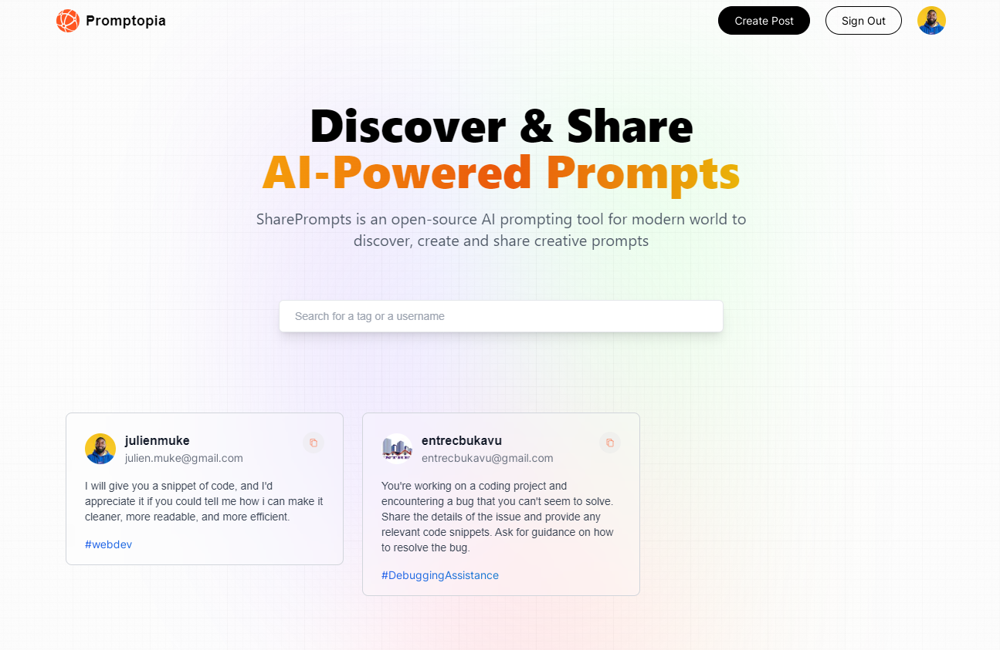

# Build and Deploy a modern full-stack CRUD app using Next.js 13 | 2023 

## Introduction
SharePrompts is an open-source AI prompting tool for modern world to discover, create and share creative prompts.

## Features:
- Login using next auth & google auth
- Search for tags, username and prompt content
- Create, edit, copy and delete any prompt
- Search prompts 
- Click on tags
- View other profiles
 
## Implementation:
- Next.js 13 App Folder Structure
- Next.js 13 Client Components vs Server Components
- Next.js 13 File-based Routing (including dynamic and nested routes)
- Next.js 13 page, layout, loading, and error Special Files
- Next.js 13 Serverless Route Handlers (Next API, Full Stack Apps)
- Next.js 13 Metadata and Search Engine Optimization (SEO)
- Three ways to fetch data in Next.js:
   - Server Side Rendering (SSR),
   - Static Site Generation (SSG)
   - Incremental Static Generation (ISR)

## Learn from JavaScript Mastery 
⭐ JSM - https://jsmastery.pro/masterclass
